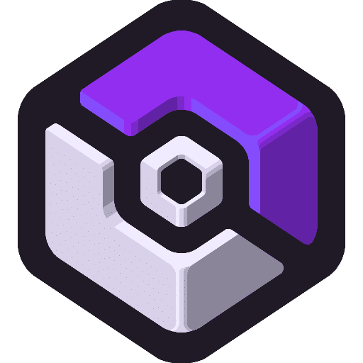

<h1 align="center">HideOut Launcher</h1>

<em><h5 align="center">Launcher Minecraft personnalisé pour CobbleVerse</h5></em>

  

<strong>HideOut</strong> est un launcher Minecraft personnalisé, pensé et développé en solo, pour offrir une expérience fluide et immersive sur le serveur CobbleVerse.

---

## ✨ À propos

HideOut est un projet personnel entièrement adapté à l’univers **Cobblemon** via le modpack **CobbleVerse**. Il facilite l’accès au serveur **HideOut** avec :

- Configuration automatique
- Installation des mods
- Lancement rapide sans stress technique

---

## 🔧 Fonctionnalités principales

* 🔐 Gestion complète des comptes (Microsoft + Mojang).
* 🧩 Installation automatique des mods via le système de distribution.
* ☕ Validation et installation automatique de Java si nécessaire.
* 📦 Téléchargement intelligent des fichiers (seulement ce qui manque ou est corrompu).
* 📰 Fil d’actualités directement intégré au launcher.
* ⚙️ Paramètres accessibles et clairs.
* 🔄 Mises à jour automatiques du launcher.
* 🌐 Affichage de l’état du serveur et des services Mojang.

---

### Plateformes supportées

| Plateforme    | Fichier                                     |
|---------------|---------------------------------------------|
| Windows x64   | `HideOut-Launcher-setup-VERSION.exe`        |
| macOS x64     | `HideOut-Launcher-setup-VERSION-x64.dmg`    |
| macOS arm64   | `HideOut-Launcher-setup-VERSION-arm64.dmg`  |
| Linux x64     | `HideOut-Launcher-setup-VERSION.AppImage`   |
